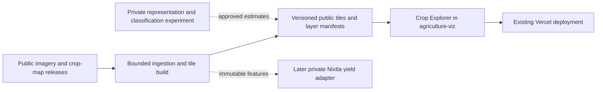

# Public Crop Explorer: satellite phase 0

Planning proposal, 5 October 2026. Build this public exploration layer **before the yield-forecast pilot**. The product is a map you can pan and zoom into, turn crop colors on over satellite imagery, and select a location to learn which crop was mapped there in a particular harvest year. This complements the existing country statistics and keeps the Radar brand and Vercel deployment.

## First experience

Open around Champaign County, Illinois, with a bounded imagery/crop footprint. Start with verified **2024** imagery and classification so the displayed year is explicit and the first learned-representation experiment can use the same completed year. Add adjacent coverage and further years after checking source access and tile costs. The UI must show the available footprint rather than imply global crop coverage.

- Pan, zoom, reset to the pilot, and open a shareable URL containing position, zoom, year and visible layers.
- Toggle satellite imagery, crop colors and approximate field outlines; adjust overlay opacity and filter crop classes.
- Select a point or field outline to see mapped crop, classification year, imagery acquisition/composite window, native resolution and linked source.
- Keep maize/corn, soybeans, wheat, other crops, grass/pasture and unavailable land distinct, with provider class definitions available in the source drawer. A corn land-cover class does not necessarily distinguish grain from silage.
- Once a second year is audited, allow year switching and a comparison slider. Account for differing resolutions before creating any crop-change metric.
- On mobile, use a collapsible legend and a selection drawer. Include keyboard map controls and an accessible text summary of the selected location.

The interaction can feel like a familiar street/satellite map while using public agricultural data. [Sentinel-2](https://dataspace.copernicus.eu/data-collections/copernicus-sentinel-missions/sentinel-2) has 10 m visible/near-infrared bands and coarser additional bands: that supports many large agricultural fields, but zooming further does not create fence-level detail. Display native resolution and preserve classification categories with nearest-neighbor resampling.

## Public sources can deliver crop colors first

| Source | Initial role | Interpretation |
| --- | --- | --- |
| Sentinel-2 surface reflectance | Public RGB imagery/composites for the pilot, with documented cloud treatment and acquisition window | Imagery date can differ from classification year. Show both. A cloud-free mosaic combines observations and must be labeled as a composite. |
| [USDA Cropland Data Layer](https://data.nass.usda.gov/Research_and_Science/Cropland/sarsfaqs2.php) | Annual published crop-class raster; public domain; 10 m from 2024, with earlier years at 30 m | Existing satellite-derived classification, not a classifier trained by Radar or confirmation of what is planted today. Preserve source classes and missingness. |
| [USDA Crop Sequence Boundaries](https://www.nass.usda.gov/Research_and_Science/Crop-Sequence-Boundaries/index.php) | Optional selectable field-like outlines and historical crop sequences | These are estimated crop-field boundaries derived from public data. They are not ownership or cadastral parcels. Pin the eight-year boundary window; a boundary product can use years later than the crop year being viewed. |
| [Crop Map of England (CROME)](https://www.data.gov.uk/dataset/0f52fe52-80f6-4aa7-bee2-afb9a320f631/crop-map-of-england-crome-2024) | England provider adapter after the initial layer, or an alternative first region | Existing annual classification under the Open Government Licence. Its hexagonal cells are a mapped representation, not individual field parcels. Retain its attribution and class meanings. |

This is a genuine crop-exploration release using existing public classifications. It does not depend on annual yield labels, a new trained model, the seasonal forecast contract, or waiting for the 2027 growing season. Publish source classifications with their actual year and methodology; show unavailable coverage explicitly.

For a selected field outline, use a documented dominant class or class proportions derived from the underlying categorical raster, with an ambiguity state for mixed fields. Source estimates and classifier probabilities have different meanings. Do not invent a confidence percentage when the provider does not supply an appropriate measure. Optional sequence history must retain each year's provenance.

## Learning experiment: useful representations, then crop names

Self-supervised representation learning is useful for recognizing similar field/vegetation patterns. Named classes such as wheat and maize still require labeled examples or another defensible way to associate patterns with crop names. Clusters can be exposed as experimental “similar vegetation patterns” without assigning unsupported crop names.

A bounded experiment can use public [AlphaEarth satellite embeddings](https://developers.google.com/earth-engine/datasets/catalog/GOOGLE_SATELLITE_EMBEDDING_V1_ANNUAL) with a small supervised classifier or a similarity search, rather than training a large encoder from scratch. The annual vectors are 10 m representations summarizing a full calendar year. Use a verified available year; they are suitable for historical exploration, not early-season forecasts. The catalog documents CDL among the released model's training targets, so describe this as a pretrained foundation-model experiment rather than claiming purely self-supervised crop discovery. CDL agreement would also be an insufficient independent accuracy test.

Prototype a “find similar fields” interaction or a separate experimental inferred-crop layer over a small region. Train in the private modeling repository; record encoder/version, input year, training-label lineage and out-of-fold predictions. Evaluate by held-out regions and seasons with independent labels before publishing named crop predictions or calibrated probabilities. Keep provider crop maps and Radar estimates visibly distinct. This research can run alongside the explorer and cannot block its first public release.

Annual embeddings, current-season source maps and field boundaries assembled using later years must pass the forecast project's availability rules before reuse as yield features. Historical visualization is allowed to use subsequently published data with its provenance; a forecast at an earlier issue date has a stricter information set.

## Serving architecture

Use [MapLibre GL JS](https://maplibre.org/maplibre-gl-js/docs/examples/add-a-raster-tile-source/) for the new `/crops` view. Load the map bundle on that route. Keep existing country exploration and benchmark prices available through the current navigation.

Public provider-ingestion code and layer metadata can live in `agriculture-viz`; classifier training, weights and evaluation stay private in `agriculture-forecast`. Heavy extraction can share the batch worker with later satellite features. RGB and categorical tiles are public derivatives only where source terms permit; retain required credits and source/version manifests.

Audit documented public tile/OGC services for permitted use, stability, CORS, attribution and point queries. Where those are unsuitable, build a small immutable XYZ pyramid from licensed source windows and publish it to object storage/CDN. Do not depend on temporary map IDs copied from another public viewer. Keep large rasters and embeddings outside Git and Vercel. The first storage/provider choice follows a bounded tile-access benchmark.

Use raster tiles for imagery and crop classes, and vector tiles or a bounded spatial query for field outlines. Request only the viewport and relevant zooms; never load all Illinois field polygons as one GeoJSON file. A class selection must query the underlying categorical data or a versioned field summary, not guess a class from a rendered color. Low zoom can generalize display, with precise selection enabled at a suitable zoom. Empty coverage and tile failures need visible states.

Add an observation-layer manifest, separate from forecast v2/v3, containing layer ID/version, provider, class lookup, harvest year, acquisition window, native resolution, boundary-window version, bounds, tile/source URLs, no-data rules, query method and attribution. The same version must drive the legend, visible pixels, selection drawer and downloads. This metadata can later supply the shared availability contract; it does not carry forecast intervals.

Vercel remains the public Next.js frontend on the current project/team. Imagery and tile/model computation run before publication. Release a reviewed frontend/data PR and use the normal Git preview and production deployment. There is no need to introduce a public inference service for the first explorer.

## Bounded implementation and release gates

Allow roughly **1–2 engineering weeks** for an initial public explorer once source windows and hosting are verified, with approximately one additional week if custom tiling or point-query infrastructure is required. This is an estimate for a bounded pilot, not national/global coverage or a newly trained classifier.

| Ticket | Deliverable | Completion evidence |
| --- | --- | --- |
| CROP-01 | Audit one 10–20 km imagery/crop window, a matching year and optional field-boundary source; benchmark tile/query delivery | Readable assets, source rights/credits, class definitions, compatible coordinates, measured cost and a clear public footprint. |
| CROP-02 | Immutable imagery/class tiles and observation-layer manifest; optional field summaries | Known sample locations agree with source raster values; no-data, cloud treatment, resampling and mixed fields are preserved. |
| CROP-03 | Branded `/crops` view, pan/zoom, toggles, opacity, legend, point/field drawer and shareable URLs | Desktop/mobile and keyboard flows work; selected crop/year/source agree with the displayed layer; no overflow or console errors. |
| CROP-04 | Public preview and release, then bounded coverage/year expansion | CI/build pass; tiles and queries work in production with credits; failed/missing coverage is visible. Proposed cold usable-view target is five seconds on a declared mobile network profile, to be measured. |
| CROP-05 | Optional private embedding/similarity/classification experiment | Pretraining/label lineage, blocked evaluation and separately labeled research output. No named-crop accuracy claim from clustering or CDL agreement alone. |

Measure bytes, tile requests, storage and egress at CROP-01. Propose a $100 cap for the initial hosting/extraction experiment, counted within the satellite plan's overall experiment budget; choose traffic limits and an operating estimate before expansion. Public source data and permissive dataset licences do not imply unlimited free hosted tiles. This proposal does not provision paid infrastructure.

Sequence: **public crop explorer → optional representation/classification experiment → issuance-aware yield forecasting**. The yield data audit can proceed alongside the explorer, while yield release gates and the shared Nixtla architecture remain as described in [SATELLITE_PHASE_PLAN.md](SATELLITE_PHASE_PLAN.md).
