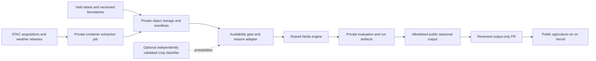

# Satellite feature phase: proposed implementation plan

Status: planning proposal, researched on 5 October 2026. No satellite model, paid infrastructure or yield forecast is being launched by this document. This develops the [satellite roadmap](SATELLITE_ROADMAP.md) and follows the [shared Radar architecture](SHARED_ARCHITECTURE.md).

## Recommended pilot and first product

Start with **maize for grain in Illinois, at county level**, conditional on the data audit below. The first product is an experimental, within-season forecast of the county's eventual annual yield in tonnes per hectare, with a dated issue, prediction bands and imagery coverage. Use June, July, August and September issue stages; each stage predicts the same harvest-season outcome. The satellite layer should also explain observation age and vegetation conditions without implying that vegetation index equals yield.

USDA publishes Illinois county estimates of corn planted area, harvested area, yield and production; its [2024 county release](https://www.nass.usda.gov/Statistics_by_State/Illinois/Publications/County_Estimates/2025/20250506-IL-Corn-County-Estimates-2024.pdf) is a verified example. [Quick Stats](https://data.nass.usda.gov/Quick_Stats/) is the proposed machine-readable label source. This gives a clearer county target than inferring local yields from national totals. Complete history, suppression and the latest completed season still require an audit.

Keep **England wheat** as the next adapter. Defra publishes [country and English regional cereal yields](https://www.gov.uk/government/statistics/cereal-and-oilseed-rape-production/cereal-and-oilseed-production-in-the-united-kingdom-2025); [CROME](https://www.data.gov.uk/dataset/0f52fe52-80f6-4aa7-bee2-afb9a320f631/crop-map-of-england-crome-2024) provides an existing satellite classification under the Open Government Licence. Regional yield labels cannot validate county or field yield claims. Audit that smaller panel before choosing its model or promising field-level predictions.

A new crop classifier is a separate capability. Begin yield research with an existing, release-safe crop mask and compare it with a general cropland mask. Research current-season maize probabilities in a later workstream. A classifier trained and scored against the same satellite-derived map measures agreement with that map; it does not establish independent crop accuracy.

## Data audit: the first implementation ticket

Timebox this to three to five working days. Download small samples and metadata before a full imagery backfill. Produce a private `pilot-audit.json`, a coverage table, a bounded extraction benchmark and a go/no-go decision.

| Input | Proposed source and scope | Audit requirement |
| --- | --- | --- |
| Yield labels | NASS Quick Stats; Illinois county annual corn-for-grain yields, with longer pre-satellite history where available | Pin survey/commodity/practice/statistic/unit definitions; distinguish grain from silage, all-practice from irrigated subsets, and annual survey from Census records. Preserve suppression and unavailable values. Record release/retrieval/revision dates. |
| Area labels | Corresponding NASS planted and harvested acres | Keep planted and harvested area separate. Grain yield denominators and geography must agree; an existing corn land-cover mask may also include silage. |
| Crop masks | [USDA Cropland Data Layer (CDL)](https://data.nass.usda.gov/Research_and_Science/Cropland/sarsfaqs2.php), county/window subsets | Pin year, class lookup, checksum and release date. CDL is satellite-derived and public domain; it changes from 30 m in 2008–2023 to 10 m from 2024. Preserve native resolution and compare on a documented common grid. |
| Optical imagery | Sentinel-2 L2A surface reflectance via [Copernicus STAC](https://documentation.dataspace.copernicus.eu/APIs/STAC.html) | Inventory acquisitions, usable pixels, downloadable assets, processing baseline and reflectance offsets for each county/season. A catalog result alone does not prove asset access. Check account quotas and attribution. |
| Weather | [Daymet historical data](https://daymet.ornl.gov/overview), with [monthly-latency products](https://daac.ornl.gov/DAYMET/guides/Daymet_V4_Daily_MonthlyLatency.html) evaluated for operations | Separate retrospective annual releases from provisional monthly products. The monthly product starts in 2021 and arrives after the measured month; exclude unavailable recent weather at issuance. Verify actual release times and retrieval requirements. |
| Geography | Versioned [Census TIGER/Line county boundaries](https://www.census.gov/geographies/mapping-files/time-series/geo/tiger-line-file.html) | Join five-character county FIPS as strings; audit boundary changes. Use detailed boundaries for extraction and simplified derivatives for the browser. |

Target nine completed imagery seasons, **2017–2025**, subject to verified overlap. Require at least eight usable seasons and 60 counties, with at least 80% usable county-season observations on the frozen eligible panel. Define exclusions before looking at final evaluation scores. If those requirements fail, revise the pilot or history before modeling; do not replace suppressed yields with neighboring values or create monthly copies of annual labels.

The initial extraction benchmark should cover roughly ten counties, two contrasting seasons and several cloudy/clear scenes. Measure wall time, bytes read, retained storage, valid-area coverage and cost. Identify a source for independent crop labels at this stage; lack of those labels blocks a new classifier's public accuracy claim, but need not block yield research using existing masks.

### Verified availability warning

A bounded STAC query on 5 October 2026 returned July 2017 Illinois acquisitions. One example is [item `S2B_MSIL2A_20170728T164859_N0500_R026_T16TCK_20231007T201625`](https://stac.dataspace.copernicus.eu/v1/collections/sentinel-2-l2a/items/S2B_MSIL2A_20170728T164859_N0500_R026_T16TCK_20231007T201625): acquisition 28 July 2017, catalog `created` 31 March 2024. These catalog timestamps are not a complete account of original availability. The archive includes [reprocessed L2A products](https://documentation.dataspace.copernicus.eu/Data/Others/Sentinel2_L2A_baseline.html).

Consequently, backfilled imagery must initially be described as **retrospective/revised-history research**, even when acquisition windows stop at the simulated issue date. Do not backdate a reprocessed asset or today's derived features to its overpass. Start saving actual source and derived-feature vintages now so prospective evaluation can use the real information set.

## Architecture and ownership

| Home | Responsibility |
| --- | --- |
| Private `agriculture-forecast` | Satellite/label adapters, extraction configuration, crop calendar, classification research, domain selection policy, fitted models and evaluation. Add a `satellite/` module and private audit/run manifests here. |
| Private shared `radar-forecast`, currently in `inflation-forecast/packages/radar-forecast` | Add annual-panel eligibility, label availability, season-aware folds and an MLForecast runner through generic interfaces. Both forecast repos consume the same versioned release. No Illinois-specific crop rules in the shared package. |
| Public shared `radar-contracts`, currently in `inflation-viz/packages/radar-contracts` | Define a seasonal forecast contract and generated Python/TypeScript/schema validators. Maintain monthly v2 compatibility and existing brand assets. |
| Public `agriculture-viz` | Public observations, licensed summarized satellite coverage, seasonal forecast outputs, county UI and methodology. No private engine, classifier weights or evaluation artifacts in the frontend repository. |
| Batch worker and private object storage | Windowed raster reads, temporary raster cache and immutable Parquet/manifests. Choose deployment location after measuring data access and egress. Vercel continues to serve the public Next.js app. |

Use a portable CPU container initially; benchmark approximately 4 vCPU/16 GiB with concurrency capped at two jobs. Cache or read only the required bands/windows, aggregate incrementally, and retain immutable source references/checksums plus essential derivatives. Avoid a full national raster copy, a permanent database or a GPU service in the first pilot.

GitHub Actions can orchestrate the bounded batch job and retain small diagnostics. The private forecast workflow continues to produce a manual, output-only publication PR, matching inflation. The least-privilege publication credential stays in the private repository's secret store. Merging public outputs triggers the existing Vercel Git deployment; no imagery processing runs during a Vercel build or request.

Planning limits, rather than supplier quotes: a **$250 maximum extraction experiment**, then a **$100/month shadow-operation target**. Measure compute, storage, requests and egress separately before expanding. These are proposed budget gates; no infrastructure or spend is provisioned by this plan.

## Features, timing and native Nixtla execution

Persist satellite measurements in the existing long feature shape: `unique_id, ds, feature, value, available_at, known_future`. A measurement's `ds` is its observation/composite period; `available_at` includes source availability and completed derivation. Satellite observations use `known_future=false`. Keep source item/version, acquisition window, retrieval/derivation times, geometry version, crop mask vintage, valid-area fraction and observation count in the immutable manifest. Unknown historic availability stays unknown.

Apply the shared availability gate at the actual issue timestamp **before** aggregating measurements into season features. Begin with cloud/shadow-masked vegetation and moisture summaries, observation age and missingness; add radar only if optical gaps justify its processing cost. Composites end at issuance and use no later acquisitions, centered smoothing or end-of-season phenology. Missing imagery leads to an explicit exclusion or a separately evaluated fallback, never a zero vegetation value.

Use only crop maps already released at issuance. Previous-season CDL is a potentially noisy mask because crop rotation changes the current crop; measure that error. Current-season end-of-season CDL may be used to score classification or in a clearly separated oracle experiment, but never as an operational yield input. If a classifier later supplies masks, generate training features from spatial/season out-of-fold classifier predictions so the yield evaluation includes realistic classification error.

The annual target panel remains Nixtla's `unique_id, ds, y`, with one row per county and harvest year. A stable identity could be `US:IL:17019:maize-grain:yield`; `ds` identifies the harvest season, separately from issuance. Keep the original bushels/acre label and a documented grain-mass/hectare conversion alongside the normalized `t/ha` target. Fit only labels actually released before issuance; the latest calendar year is not automatically the latest usable label.

For each issue stage, build the same stage's as-of season summaries for historical training years and the target year. Use **StatsForecast** for annual statistical baselines and **MLForecast** for the pooled county model with annual target lags and release-safe seasonal covariates. Nixtla's [exogenous-feature interface](https://nixtlaverse.nixtla.io/mlforecast/docs/how-to-guides/exogenous_features.html) requires prediction-time covariates in `X_df`: the adapter supplies already observed stage summaries, not guessed future weather or vegetation. Separate stages may use separate fitted runners; they do not multiply the number of independent annual outcomes.

The current shared runner and eligibility checks are monthly, so this is an actual engine extension with compatibility tests, not merely an extra dependency. Reuse scoring, availability, evaluation and interval abstractions where their assumptions hold. Add explicit annual cadence and release-lag handling. NeuralForecast and TimeGPT are later experiments if the panel and benchmarks justify them; neither is the initial image classifier. Do not sum county yields or interval endpoints. State production and harvested-area-weighted yield require compatible area data and joint uncertainty, and are outside the first release.

## Evaluation and release gates

Freeze the experiment specification before final scoring. Use longer available yield history for statistical baselines and the verified imagery overlap for satellite models. Compare the last released yield, trailing climatology, a trend baseline, weather-only prediction and weather-plus-imagery prediction at each issue stage. All comparisons use the same eligible targets and information rules.

For a complete 2017–2025 feature panel, a proposed split is development/tuning through 2019, validation in 2020, interval calibration in 2021–2022, and untouched final evaluation in 2023–2025. Earlier feature years supply the initial training history. Confirm the split after the coverage audit, before fitting. Rolling refits may use newly released earlier outcomes under a frozen algorithm; final evaluation scores never select features, candidates or interval widths. If history is shorter, change the design before scoring rather than borrowing final years for tuning.

Report two distinct tests: rolling prediction for known counties, and transfer to contiguous held-out county blocks with spatial buffers. Fit scalers, imputers, crop classifiers, feature selection and calibration using only the allowed fold. Assess uncertainty with season/spatial blocks; many pixels or correlated counties do not create many independent seasons. Three final seasons provide limited evidence, which must be visible in any release.

| Gate | Proposed acceptance condition | If it fails |
| --- | --- | --- |
| Data and extraction | Audit coverage threshold met; definitions/units/boundaries agree; reproducible extraction and cost benchmark; no future inputs in replay checks | Change the scope or keep research private. |
| Satellite value | At least 5% lower MAE and RMSE than the strongest nonsatellite baseline on validation and final evaluation for each issue stage proposed for release; report block uncertainty and per-season behavior | Publish monitoring only, retain the evaluated baseline, or keep yield outputs private. Do not retune on the failed final set. |
| Bands | Evaluate 50/80/95% bands, interval score and width by issue stage, year and county block. Require at least 75% empirical coverage for the nominal 80% band on the final set, with uncertainty reported; no material unexplained regional failure | Rework calibration using development data and a new holdout, or withhold the affected stage/geography. A pooled percentage does not establish future coverage. |
| New classification | Independent labels in held-out spatial blocks and seasons; proposed maize precision and recall each at least 0.85, calibrated probabilities, plus area error against compatible independent planted-area totals | Keep classifier results internal; CDL agreement can remain a research diagnostic. Freeze sampling and area tolerance during the audit. |
| Operational release | Real timestamps and immutable vintages; repeatable run; public contract accepted; map/chart/download match; source and missingness visible; all affected sister-project CI checks pass | Retain the last approved release and show its issue date. |

These thresholds are proposed pilot decisions, not measured results or accuracy promises. A retrospective experiment that passes them can support a labeled research preview; a claim of prospective performance requires later live issues and released outcomes. Record separate missing-data, baseline-only and experimental states. Never hide unsupported counties inside a national coverage claim.

## Public seasonal contract and interface

Propose a **shared v3 envelope with a tagged cadence**, while continuing to read monthly v2 price/inflation outputs. This document is a design brief, not an implemented schema. Contract work should settle the following fields and reject ambiguous timing:

| Field group | Seasonal meaning |
| --- | --- |
| Identity and provenance | `schemaVersion`, `runId`, `generatedAt`, explicit `issuedAt`, observation `dataVintage`, `featureVintage`, `boundaryVersion`, source references and evaluation basis |
| Cadence | `kind: harvest-season`, versioned crop calendar, issue stage, target `seasonId` and period boundaries, `horizonSeasons`; never `horizonMonths` for an annual target |
| Series | Stable county/crop/metric ID, geography ID, target definition, `t/ha` unit, status, interval status and imagery coverage summary |
| Points | Existing `unique_id, ds, yhat, lo, hi, bands` conventions plus season identity; `ds` labels the target season and may precede the within-season issue date |
| Coverage and totals | Included/missing targets with reason codes; `totalUniqueId: null` for yields; no inferred additive total |

The shared validator must enforce finite nonnegative yields, nested bands, consistent geography/units/season, and public allowlisting. Explicitly test issue dates, label release lag and current-season nowcasts instead of carrying over the monthly future-date rule. Run contract compatibility tests in all four repos when releasing the package. Monthly production output migrations remain independent of the agriculture seasonal pilot.

Add a separate **Satellite pilot** view within Agriculture Radar using the current Radar typography, surfaces, navigation and source drawer. Show county yield predictions in `t/ha`, issue date/stage, harvest year, observed history, bands, last usable imagery date and valid-area coverage. Keep county pilot navigation distinct from the existing country observation map. Show vegetation indices in their own units; clearly label classifier estimates, historical source maps and official observations. Downloads must contain the displayed vintage and timing fields. Start with small county summaries and simplified boundaries; serve tiles only when payload measurements justify them.

## Work sequence and deliverables

Allow roughly **8–10 engineering weeks** for the yield pilot, assuming one primary Python/geospatial engineer with frontend support and agronomic/statistical review. This is effort guidance, conditional on the audit; independent classification labels and a full prospective growing season can take longer.

| Ticket | Phase and effort | Concrete deliverable / dependency |
| --- | --- | --- |
| SAT-01 | Data audit, week 1 | Private sample manifests, county-season coverage, release timing audit, unit/definition crosswalk, extraction benchmark, independent-label options and go/no-go. Start here. |
| SAT-02 | Feature extraction, weeks 2–3 | Containerized bounded backfill, cloud/reflectance checks, immutable Parquet vintages, crop-mask comparison and current acquisition collector. Requires SAT-01. |
| SAT-03 | Shared annual engine, weeks 3–4 | Annual eligibility and release-safe label adapter, MLForecast runner, frozen stage datasets, monthly regression tests and coordinated private package release. Requires audited target definitions. |
| SAT-04 | Yield shadow evaluation, weeks 5–6 | Disjoint folds, baseline comparisons, satellite ablation, calibrated intervals, private evaluation report and release recommendation. Requires SAT-02/03. |
| SAT-05 | Contract and product view, weeks 6–8 | Shared cadence contract proposal then implementation, fixtures/consumer tests, county view and browser/download verification. A public forecast release depends on SAT-04 passing. |
| SAT-06 | Operational trial, weeks 8–10 | Two repeatable scheduled collection/run cycles, missing-data behavior, cost report, release checklist and output-only PR. Archive issue vintages even if forecasts remain private. |
| SAT-07 | Classification research, separate workstream | Independent label agreement, blocked partial-season training/evaluation, uncertainty and mask-to-yield comparison. Public classifier release depends on its own gate. |
| SAT-08 | England wheat adapter, after pilot evidence | Regional label/imagery audit, crop/calendar/source adapters on the same engine and contract; repeat local evaluation before expansion. |

Given the October 2026 planning date, the completed-season backfill is retrospective. Do not present an October run as an early-2026 crop forecast. The first proposed prospective Illinois issues are **June–September 2027**, subject to data releases and the gates above. Archive inputs and outputs at issuance; score them only when the corresponding county outcomes become available. A technical preview can be ready sooner, clearly labeled with its research basis.

The immediate next action is SAT-01, not a global imagery download or frontend yield overlay. Its audit should settle the eligible county list, exact completed seasons, independent classification labels, actual source access, compute location and measured budget before SAT-02 starts.
